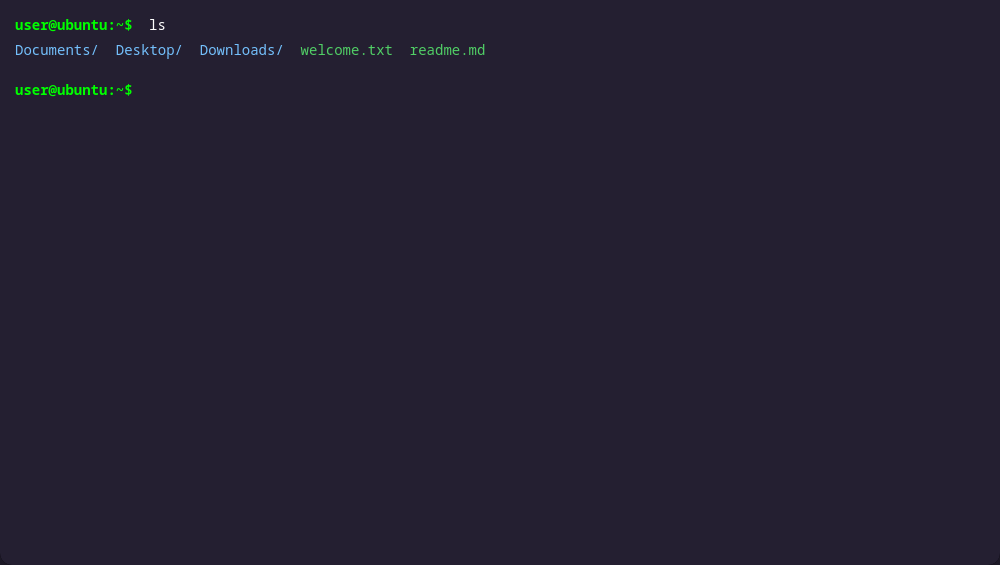
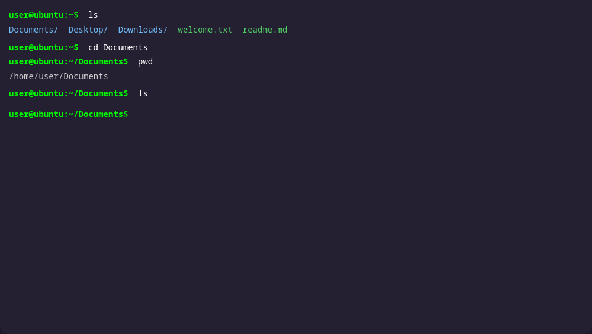

# Linux Transition Guide Part 3: Learning the Terminal
## Intro
Don't panic after seeing that title; this part is going to be easy. You are going to learn some nice, short commands, and learn how to install and uninstall packages.
## What this part will cover
- Essential commands
- Managing packages with a package manager
## Learning the terminal
### Moving around directories
What? What's a terminal? I thought we weren't going to be using those! Calm down, you're only going to be typing like 20 letters. You can almost always use GUI (graphical user interface) applications for everything that these commands do, but it is always nice to know some of these just in case. Open up whatever menu you use for searching (the bottom-left menu on Plasma and Cinnamon, the top search bar or app drawer in GNOME), search for a terminal (Konsole on Plasma, GNOME Terminal on GNOME and Cinnamon), and open it. You should see a window come up that shows `username@hostname:~$`.


> Note that I usually use a different terminal, a differnt window manager, and a different shell. I usually use the 'fish' shell, but I am using an online terminal emulator (terminux.live) for some of these examples that is almost identical to the one that you will be using.

 Now, type in `ls`. This lists all files and directories at the current directory, which is currently your home directory, as shown by the ~. You should see an output with some directories such as Documents, Downloads, Videos, Pictures, etc. 
 
 

 There should be some hidden directories, too. All hidden directories start with a period, such as `.local`. To view all files and directories including hidden ones, run `ls` with the -a flag: `ls -a`. To go in to one of these directories, use the `cd` command followed by the directory. Let's go into the Documents folder with `cd Documents`. Note that everything in Linux is case sensitive. If you ever want to get the full absolute path of where you are, use `pwd`, which prints the working directory, which in this case is `/home/user/Documents`. Note that `~` can be used instead of `/home/user`.



### Managing files
Now if you run `ls`, nothing should show up because your documents folder is empty. Let's change that. Use the command `touch` to make a file. Let's make one called `beans.txt`. If you think you can figure out how to make the file, go ahead. If you're stumped, the command is `touch beans.txt`. Easy so far, right? 

Type `cd ..` to go up a directory, back to ~. Now, try `cat Documents/beans.txt`. The `cat` command basically spits out the contents of the file. In this case, it will output nothing. `Documents/beans.txt` is using a relative path. Now let's try using an absolute path. Go back into Documents with `cd Documents`, then make a new file in the Downloads directory with `~/Downloads/beans2.txt`. If you were to run `cat Downloads/beans2.txt` (without the ~), that would be a relative path and would try to read the file in `~/Documents/Downloads/beans3.txt`. Now to edit one of these files, you can use the editor built into the Linux kernel called nano. Make sure that you are in `~/Documents` first, then type in `nano beans.txt`. It should open up an editor window. Type in anything you want, I did "Hello World!". Hit ctrl+o then enter to save, and ctrl+x to exit. Now if you do `cat beans.txt`, you should see something like this:

```bash
[user@bean-machine Documents]$ cat beans.txt
Hello, World!
```

Now to remove the file, use the `rm` command. Be careful with this one!

```bash
[user@bean-machine test]$ ls
beans.txt
[user@bean-machine test]$ rm beans.txt
[user@bean-machine test]$ ls
[user@bean-machine test]$ 
```

To make a directory (what you might call a folder), use the `mkdir` command.

```bash
[user@bean-machine Downloads]$ mkdir test
[user@bean-machine Downloads]$ cd test
[user@bean-machine test]$ ls
[user@bean-machine test]$ mkdir test-subfolder
[user@bean-machine test]$ ls
test-subfolder
[user@bean-machine test]$ rm test-subfolder
rm: cannot remove 'test-subfolder': Is a directory
[user@bean-machine test]$ rm -rf test-subfolder
```

To remove a directory, use the `rm` command with the -rf flag as shown above. Again, be **very** careful with this! Some people try to troll noobs by telling you to run `sudo rm -rf ~/`, which deletes your entire home directory. **Never run that command!** If you do fall for it, I will judge you profusely.

### Other commands
To execute a script, use `.` followed by the script to be executed (usually a .sh file).

```bash
[user@bean-machine test]$ ./install.sh
```

When you make a file, it is not executable by default. For example, if you run `touch script.sh`, `nano script.sh`, add to the file, then try to run it with `./script.sh`, it would tell you that the script is not executable. To make a script executable, use the `chmod` command with +x.

```bash
[user@bean-machine test]$ chmod +x install.sh
```

### About the superuser
You should almost always be logged in to your session with a normal user, which has permission to change anything in that user's home directory (anything under `/home/user/` or `~/`). The superuser, also known as the root user, can modify anything. You should never run your session as the superuser, as it can introduce many security risks. Besides, most distros don't even expose the option to do so by default anyway. If you need to run a command as a superuser to, for example, edit a file that is outside of your home directory or install a package using your package manager, you can grant elevated permissions to a command by prefixing it with `sudo`. For example, if you do not have permission to edit `/etc/example/config.json`, you would need to use `sudo nano /etc/example/config.json`. Remember to use sudo wisely and understand the commands that you are running!

Lastly, if you are ever stumped about what a command does, prefix it with `man`, short for manual. You may need to install the man package manually, but it is a helpful tool if your web browser is too slow to look stuff up (or you just don't want to).

## Installing your first package
Now to make your system actually useful. First, we will install a package using `apt` for Debian (and Mint, because Mint is Ubuntu based, and Ubuntu is Debian based) or `dnf` for Fedora, then you will open the GUI store to get one in a more simple and easy manner.

Open your terminal once again and type in `sudo apt update` or `sudo dnf update` to update your system. You should always try this if things are not working as expected or if you have not done it in a while. Next, put in `sudo apt install fastfetch` or `sudo dnf install fastfetch`. It should ask you for your password (because you used sudo), then it should install the package. Once it has finished (assuming that it did not fail), run `fastfetch` in your terminal, and you will get a cool screen that displays your system stats!

> If you want to have fastfetch run each time you open a terminal, you can edit your `bashrc` file. To do so, run `nano ~/.bashrc`, put `fastfetch` at the bottom, save with ctrl+o then enter, and exit with ctrl+x. Now, fastfetch should run each time you start a bash session!

You don't always have to install packages with the terminal. You can use the store built in to your distro, which is either GNOME Software (for Debian and Fedora on GNOME), Software Manager (Mint Exclusive), or Discover (for anything with KDE Plasma). Just open the popup menu and search for "store" (definitely because I have not used Mint at all for a year and am not even using it while writing this guide and therefore forgot what the store was called... definitely not). Open up the app store, and search for an application (such as prismlauncher if you want to play some Minecraft, or Steam if you want to play some not Minecraft) and hit download. There you go, you just installed an application without even touching one of those nerdy terminal things.

> Linux Mint does not have something called Snap packages. This is due to their proprietary nature from Canonical (the creators of Ubuntu), so they are disabled on all Mint systems by default. I wouldn't use Snap packages or the Snap Store myself, but if you really need to, run `sudo rm /etc/apt/preferences.d/nosnap.pref && apt update && apt install snapd` to get rid of the thing blocking Snap and download Snap Store. Also, you can use && to chain commands, and `x || y` to only trigger command y if x returns an error (returns an exit code not equal to 0).

## Outro
Great, you learned some essential terminal commands and installed your first few packages. I hope you are enjoying Linux so far, and there may or may not be a part 4 of this guide. You might want to go check :3
advanced
Either way, you have officially completed the beginner's course! Click the button below to unlock the next section of this guide.

<button onclick="setAdvancedCookie()">Unlock Advanced Section</button>
<button onclick="resetAdvancedCookie()">Reset Advanced Content</button>
<script>
function setAdvancedCookie() {
    document.cookie = "advanced_unlocked=true; path=/; max-age=31536000"; // 1 year expiry
    alert('Advanced section unlocked! You can now access advanced content from the main page.');
    window.location.href = '../index.html';
}

function resetAdvancedCookie() {
    document.cookie = "advanced_unlocked=; path=/; expires=Thu, 01 Jan 1970 00:00:00 GMT";
    alert('Advanced content has been reset. Please refresh the main page to see the changes.');
}
</script>
(Note that this button adds a cookie to your browser to show the next section in the main page. If you are using a locked down browser such as LibreWolf, locked down Firefox, Tor, etc., you may not be able to unlock the next section. If this is the case, you can manually enable cookies for this site or just go to ltg.bkd.lol/advanced/part[number])

 You can go use your computer in peace now knowing that Microsoft is no longer breathing down your back, or you can go check out the other parts of the guide to learn some more advanced stuff.

If you ever need anything (or you screwed up really bad), DM me on Discord at thatbakedbeans, or send an email to thatbakedbeans@proton.me. Otherwise, Reddit is a good source of help (most of the time).